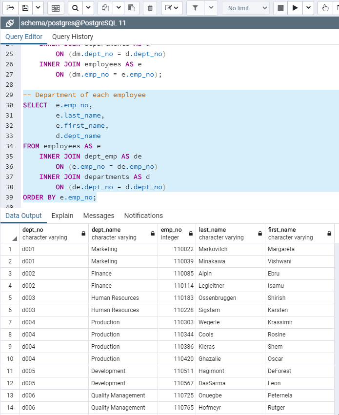

# Pewlett-Hackard  #

# Summary #
*Overview,*
*Running Code,*
*Technology used*

# Overview #
It is a beautiful spring day, and it is two weeks since you have been hired as a new data engineer at Pewlett Hackard. Your first major task is a research project on employees of the corporation from the 1980s and 1990s. All that remain of the database of employees from that period are six CSV files.
In this assignment, you will design the tables to hold data in the CSVs, import the CSVs into a SQL database, and answer questions about the data. In other words, you will perform:

* Data Engineering
* Data Analysis

# Running Code #

## Data Modeling ##
Inspect the CSVs and sketch out an ERD of the tables. Feel free to use a tool like http://www.quickdatabasediagrams.com.

(You can also check the pdf file)

## Data Engineering ##
Use the information you have to create a table schema for each of the six CSV files. Remember to specify data types, primary keys, foreign keys, and other constraints.

## Data Analysis ##
List the following details of each employee: employee number, last name, first name, sex, and salary.

List first name, last name, and hire date for employees who were hired in 1986.

List the manager of each department with the following information: department number, department name, the manager's employee number, last name, first name.

List the department of each employee with the following information: employee number, last name, first name, and department name.

List first name, last name, and sex for employees whose first name is "Hercules" and last names begin with "B."

List all employees in the Sales department, including their employee number, last name, first name, and department name.

List all employees in the Sales and Development departments, including their employee number, last name, first name, and department name.

In descending order, list the frequency count of employee last names, i.e., how many employees share each last name.

# Technology Used #
* PostGreSQL
* QuickDatabaseDiagrams.com
* ERD
* .cvs files
  
## Authors ##
Sylvain David - Data Analytics Bootcamp - Vanderbilt University - 2020
